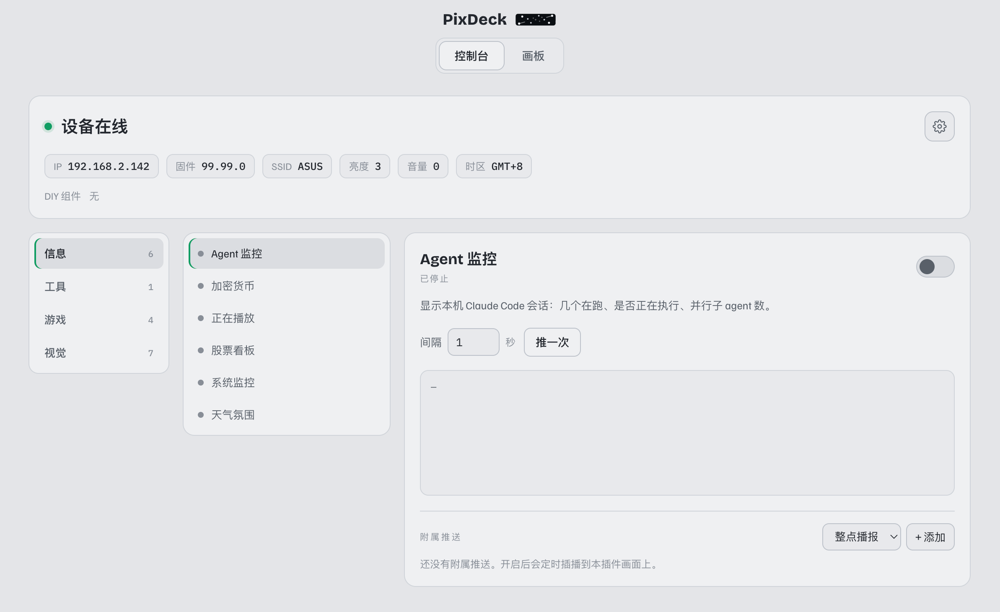

<div align="center">

# PixbarTools

**Stream live data, games, and ambient visuals to your Ulanzi Pixbar (TC002) — a 52×16 RGB pixel clock — from a local web app. No firmware flashing.**

English · [简体中文](./README.zh-CN.md)

<!-- Add a screenshot of the web UI here, e.g.:

-->

</div>

---

## Quick start

You need **Python 3** and a Pixbar / TC002 on the same Wi-Fi as your computer.

```bash
git clone https://github.com/cailurus/PixbarTools.git
cd PixbarTools
python3 pixbar_panel.py
```

Open **http://127.0.0.1:8000**, click the gear, and enter your clock's IP — it's remembered across restarts. No `npm`, no `pip install`.

> Prefer the command line? `python3 pixbar_panel.py --device <IP> --port 8000` sets it up front.

## What you can put on the clock

Toggle any of these from the web app — each runs as a small plugin pushing frames to the device:

- **Info** — US stocks, crypto prices, live weather, system monitor (CPU/RAM/GPU/disk), now-playing track, Claude Code session status
- **Games** (AI plays itself) — snake, pong, breakout, pac-man
- **Visuals** — a pixel cat, starfield, falling sand, fire, Langton's ant, auto-solving maze, fish tank
- **Tools** — a scrolling notice board for any message you type
- **Scheduled** — hourly chime, timed reminders, now-playing song-change announcements

There's also a **Canvas** tab: a 52×16 pixel editor to draw by hand, stamp text, or load and pixelize a logo, then push the frame straight to the clock.

## How it works

A local server (`pixbar_panel.py`, pure Python standard library) runs each plugin in a thread, serves the web app, and proxies the device's HTTP API — all bound to `127.0.0.1`. Your browser talks only to this local server, which talks to your clock over the LAN. Plugins live in `plugins/<name>/` and are auto-discovered.

---

<div align="center">

*Personal / educational project. Not affiliated with Ulanzi.*

</div>
